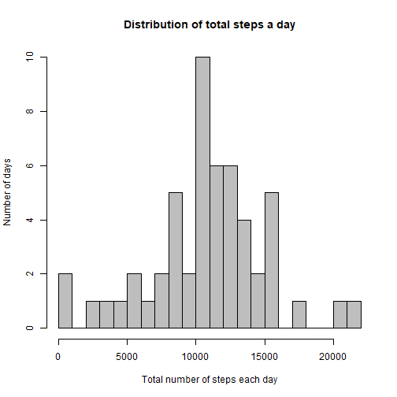
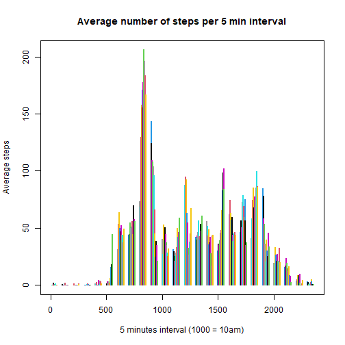
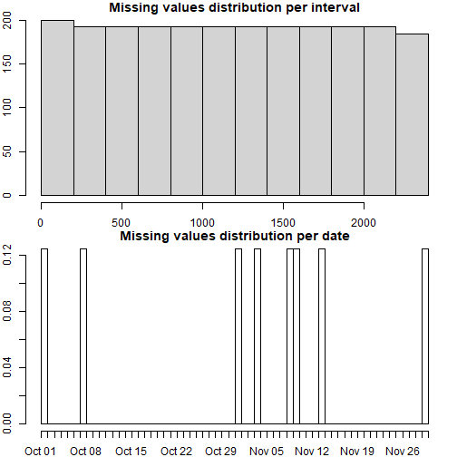
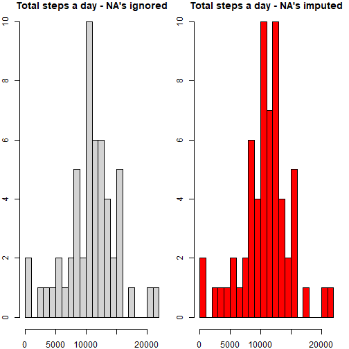
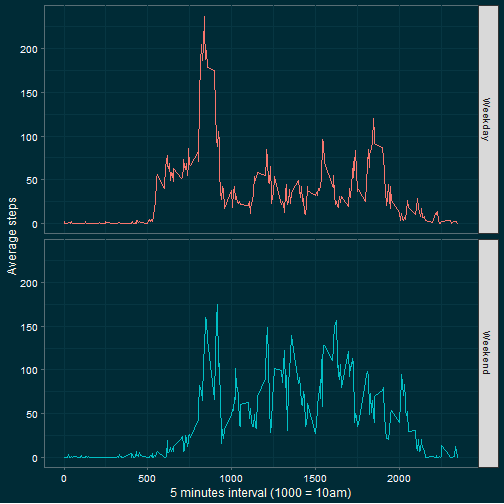

## Loading and preprocessing the data

```r
library(dplyr)
library(ggplot2)
library(ggthemes)
setwd("C:/Users/Toshiba/Desktop/Reproducible Research")
AMD <- read.csv("activity.csv")
summary(AMD)
```

```
##      steps            date              interval     
##  Min.   :  0.00   Length:17568       Min.   :   0.0  
##  1st Qu.:  0.00   Class :character   1st Qu.: 588.8  
##  Median :  0.00   Mode  :character   Median :1177.5  
##  Mean   : 37.38                      Mean   :1177.5  
##  3rd Qu.: 12.00                      3rd Qu.:1766.2  
##  Max.   :806.00                      Max.   :2355.0  
##  NA's   :2304
```

```r
str(AMD)
```

```
## 'data.frame':	17568 obs. of  3 variables:
##  $ steps   : int  NA NA NA NA NA NA NA NA NA NA ...
##  $ date    : chr  "2012-10-01" "2012-10-01" "2012-10-01" "2012-10-01" ...
##  $ interval: int  0 5 10 15 20 25 30 35 40 45 ...
```

```r
AMD$date <- as.Date(AMD$date)
```

##  What is mean total number of steps taken per day?


```r
TNOS <- AMD %>% filter(!is.na(steps)) %>% group_by(date) %>% summarise(steps = sum(steps))
```

```
## `summarise()` ungrouping output (override with `.groups` argument)
```

```r
hist(TNOS$steps, breaks = 20,
     col = "grey",
     main = "Distribution of total steps a day",
     xlab = "Total number of steps each day",
     ylab = "Number of days")
```



```r
mean(TNOS$steps)
```

```
## [1] 10766.19
```

```r
median(TNOS$steps)
```

```
## [1] 10765
```

## What is the average daily activity pattern?


```r
ADAP <- AMD %>% filter(!is.na(steps)) %>% group_by(interval) %>% summarise(steps = mean(steps))
```

```
## `summarise()` ungrouping output (override with `.groups` argument)
```

```r
with(ADAP, plot(interval, steps, type = "h", lwd = 2, col = interval,
                main = "Average number of steps per 5 min interval",
                xlab = "5 minutes interval (1000 = 10am)",
                ylab = "Average steps"))
```



```r
MNOS<-max(ADAP$steps)
MNOS
```

```
## [1] 206.1698
```

```r
with(ADAP, interval[which.max(steps)])
```

```
## [1] 835
```

## Imputing missing values


```r
sum(is.na(AMD))
```

```
## [1] 2304
```

```r
sum(is.na(AMD)/nrow(AMD))
```

```
## [1] 0.1311475
```

```r
sum(is.na(AMD$steps))
```

```
## [1] 2304
```

```r
MV <- subset(AMD, is.na(AMD$steps))
head(MV)
```

```
##   steps       date interval
## 1    NA 2012-10-01        0
## 2    NA 2012-10-01        5
## 3    NA 2012-10-01       10
## 4    NA 2012-10-01       15
## 5    NA 2012-10-01       20
## 6    NA 2012-10-01       25
```

```r
par(mfrow = c(2,1), mar = c(2, 2, 1, 1))
hist(MV$interval, main = "Missing values distribution per interval")
hist(MV$date, main = "Missing values distribution per date", breaks = 61)
```



```r
tail(MV)
```

```
##       steps       date interval
## 17563    NA 2012-11-30     2330
## 17564    NA 2012-11-30     2335
## 17565    NA 2012-11-30     2340
## 17566    NA 2012-11-30     2345
## 17567    NA 2012-11-30     2350
## 17568    NA 2012-11-30     2355
```

```r
AMD$weekday <- weekdays(AMD$date)
head(AMD)
```

```
##   steps       date interval weekday
## 1    NA 2012-10-01        0  Monday
## 2    NA 2012-10-01        5  Monday
## 3    NA 2012-10-01       10  Monday
## 4    NA 2012-10-01       15  Monday
## 5    NA 2012-10-01       20  Monday
## 6    NA 2012-10-01       25  Monday
```

```r
AMD_MV <- subset(AMD, is.na(AMD$steps))
head(AMD_MV)
```

```
##   steps       date interval weekday
## 1    NA 2012-10-01        0  Monday
## 2    NA 2012-10-01        5  Monday
## 3    NA 2012-10-01       10  Monday
## 4    NA 2012-10-01       15  Monday
## 5    NA 2012-10-01       20  Monday
## 6    NA 2012-10-01       25  Monday
```

```r
str(AMD_MV)
```

```
## 'data.frame':	2304 obs. of  4 variables:
##  $ steps   : int  NA NA NA NA NA NA NA NA NA NA ...
##  $ date    : Date, format: "2012-10-01" "2012-10-01" ...
##  $ interval: int  0 5 10 15 20 25 30 35 40 45 ...
##  $ weekday : chr  "Monday" "Monday" "Monday" "Monday" ...
```

```r
AMD_No_MV <- subset(AMD, !is.na(AMD$steps))
head(AMD_No_MV)
```

```
##     steps       date interval weekday
## 289     0 2012-10-02        0 Tuesday
## 290     0 2012-10-02        5 Tuesday
## 291     0 2012-10-02       10 Tuesday
## 292     0 2012-10-02       15 Tuesday
## 293     0 2012-10-02       20 Tuesday
## 294     0 2012-10-02       25 Tuesday
```

```r
MV_days <- data.frame(date = unique(AMD_MV$date), weekday = weekdays(unique(AMD_MV$date)))
mein <- AMD_No_MV %>% group_by(interval, weekday) %>% summarise(steps = mean(steps))
```

```
## `summarise()` regrouping output by 'interval' (override with `.groups` argument)
```

```r
MV1 <- filter(AMD, date == MV_days[1,1])
mein1 <- filter(mein, weekday == MV_days[1,2])
MV1$steps <- mein1$steps
MV2 <- filter(AMD, date == MV_days[2,1])
mein2 <- filter(mein, weekday == MV_days[2,2])
MV2$steps <- mein2$steps
MV3 <- filter(AMD, date == MV_days[3,1])
mein3 <- filter(mein, weekday == MV_days[3,2])
MV3$steps <- mein3$steps
MV4 <- filter(AMD, date == MV_days[4,1])
mein4 <- filter(mein, weekday == MV_days[4,2])
MV4$steps <- mein4$steps
MV5 <- filter(AMD, date == MV_days[5,1])
mein5 <- filter(mein, weekday == MV_days[5,2])
MV5$steps <- mein5$steps
MV6 <- filter(AMD, date == MV_days[6,1])
mein6 <- filter(mein, weekday == MV_days[6,2])
MV6$steps <- mein6$steps
MV7 <- filter(AMD, date == MV_days[7,1])
mein7 <- filter(mein, weekday == MV_days[7,2])
MV7$steps <- mein7$steps
MV8 <- filter(AMD, date == MV_days[8,1])
mein8 <- filter(mein, weekday == MV_days[8,2])
MV8$steps <- mein8$steps
AMD_NEW <- rbind(AMD_No_MV, MV1,MV2,MV3,MV4,MV5,MV6,MV7,MV8)
AMD_NEW <- arrange(AMD_NEW, date)
sum(is.na(AMD_NEW$steps))
```

```
## [1] 0
```

```r
TNOS2 <- AMD_NEW %>% group_by(date) %>% summarise(steps = sum(steps))
```

```
## `summarise()` ungrouping output (override with `.groups` argument)
```

```r
par(mfrow = c(1,2))
hist(TNOS$steps, breaks = 20,
     color="blue",
     main = "Total steps a day - NA's ignored",
     xlab = "Total number of steps each day", 
     ylab = "Number of days")
```

```
## Warning in plot.window(xlim, ylim, "", ...): "color" is not a graphical parameter
```

```
## Warning in title(main = main, sub = sub, xlab = xlab, ylab = ylab, ...): "color" is
## not a graphical parameter
```

```
## Warning in axis(1, ...): "color" is not a graphical parameter
```

```
## Warning in axis(2, ...): "color" is not a graphical parameter
```

```r
hist(TNOS2$steps, breaks = 20,
     col = "red",
     main = "Total steps a day - NA's imputed",
     xlab = "Total number of steps each day", 
     ylab = "Number of days")
```



```r
mean_old <- mean(TNOS$steps, na.rm = TRUE)
mean_old
```

```
## [1] 10766.19
```

```r
median_old <- median(TNOS$steps, na.rm = TRUE)
median_old
```

```
## [1] 10765
```

```r
mean_new <- mean(TNOS2$steps, na.rm = TRUE)
mean_new
```

```
## [1] 10821.21
```

```r
median_new <- median(TNOS2$steps, na.rm = TRUE)
median_new
```

```
## [1] 11015
```

```r
mean_new - mean_old
```

```
## [1] 55.02092
```

```r
median_new - median_old
```

```
## [1] 250
```

## Are there differences in activity patterns between weekdays and weekends?


```r
AMD_NEW <- AMD_NEW %>% mutate(daytype = ifelse(weekday %in% c("Saturday", "Sunday"), "Weekend", "Weekday"))
AMD_NEW$daytype <- as.factor(AMD_NEW$daytype)
activity_pattern <- AMD_NEW %>% group_by(interval, daytype) %>% summarise(steps_avg = mean(steps)) 
```

```
## `summarise()` regrouping output by 'interval' (override with `.groups` argument)
```

```r
g <- ggplot(activity_pattern, aes(x = interval, y = steps_avg, color = daytype)) + 
  geom_line() +
  facet_grid(daytype~.) +
  theme_solarized(light = FALSE) +
  xlab("5 minutes interval (1000 = 10am)") +
  ylab("Average steps") +
  theme(axis.text = element_text(colour = "ghostwhite"),
        axis.title = element_text(colour = "floralwhite"),
        legend.position="none")
print(g)
```


